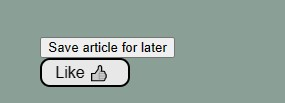
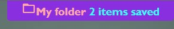
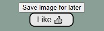

Table of Contents
- [Capstone Project - Hobbie/Interests Website](#capstone-project---hobbieinterests-website)
  - [Description](#description)
  - [Installation](#installation)
  - [How to use](#how-to-use)
  - [Credits](#credits)

----

# Capstone Project - Hobbie/Interests Website


## Description
This web app to write articles of any kind, the website allows users to save articles and images in a folder, users can also like articles and images. When a user save an article or/and an image, the website will show the number of items in the folder, the user can go to this folder (called My Folder) and see all saved items by clicking on the link to My Folder.
This website uses session storage to store the state of items saved and like buttons.

----

## Installation
1. Download the folder finalCapstone from this github repository and place it in your local machine.
2. Go to the /pages subfolder and execute the index.html file by double clicking on it.
3. The website should open on your browser.
    
----

## How to use
- To save articles into My Folder, use the buttons located under each article. Click on the "Save this article for later" button under the article you like.


- Once the article is saved, you can go to My Folder where all your saved items will be by clicking on the My Folder menu that appears at the top right of the page.


- Similarly will be to save images, click on the "Save image for later" button under the image you like.


- And, the image will be saved in My Folder.

- Liking an image and/or an article is very simple, just click on the Like button under the image/article you like.

Here is a quick preview:


- To add new articles, please use this block template. An understanding about html is required.
```
    <!-- block 1 -->
    <div class="container">
        <!-- first section for the content -->
        <section>
            <h2>Article Title</h2>
            <p>Article content</p>
            <br>
            <!-- image -->
            <figure>
                
                <figcaption>Image description</figcaption>
            </figure>
            <!-- save image for later button -->
            <div class="button-center">
                <button id="write-a-unique-id" class="save" type="button" onclick="saveForLater(this)" >Save image for later</button>
                <div>
                    <form>
                        <button id="write-a-unique-id" type="button" class="like-button no-liked">Like &#128077;</button>
                    </form>
                </div>
            </div>
        </section>
        <!-- save for later button -->
        <div>
            <button id="write-a-unique-id" class="save" type="button" onclick="saveForLater(this)">Save article for later</button>
            <div>
                <form>
                    <button id="write-a-unique-id" type="button" class="like-button no-liked">Like &#128077;</button>
                </form>
            </div>
        </div>
    </div>

    <!-- separator line -->
    <div class="separator"></div>
```
----

## Credits
 - Eustachio is the main creator of this project. Find more projects by him here [github.com/eustachi0](https://github.com/eustachi0)