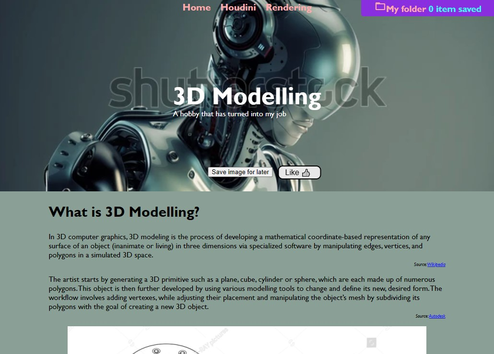

Table of Contents
- [Capstone Project - Hobbie/Interests Website](#capstone-project---hobbieinterests-website)
  - [Description](#description)
  - [Installation](#installation)
  - [How to use](#how-to-use)
  - [Credits](#credits)

----

# Capstone Project - Hobbie/Interests Website

## Description
This web app allows users to save articles and images in a folder, users can also like articles and images. When a user save an article or/and an image, the website will show from any page the number of items in this folder, the user can go to this folder (called My Folder) and see all items by clicking on the link to My Folder. Please follow instructions below.

----

## Installation
Some text here

----

## How to use
Some text here

----

## Credits
 - Eustachio is the main creator of this project. Find more projects by him here [github.com/eustachi0](https://github.com/eustachi0)