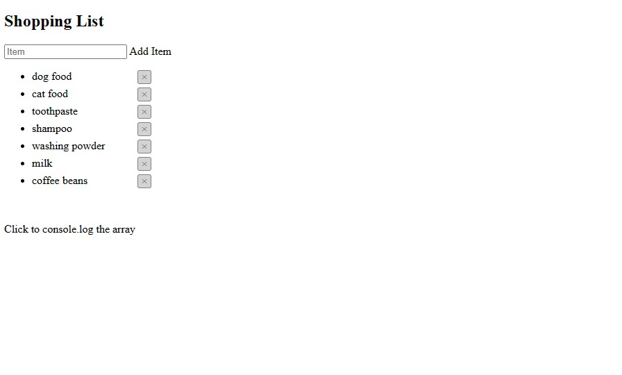

Table of Contents
- [Shopping List Project](#shopping-list-project)
  - [Description](#description)
  - [Installation](#installation)
  - [How to use](#how-to-use)
  - [Credits](#credits)

----

# Shopping List Project

## Description
This web app allows users to create a simple shopping list. Items added using the form will be display in a list, items can be marked as done or deleted.
This web app does not use session storage or local storage, changes will dissapear when the page is refreshed.

----

## Installation
1. Download the files from this github repository branch and place them in a folder you created in your local machine.
2. Go to the folder and execute the index.html file by double clicking on it.
3. The website should open on your browser.

    
----

## How to use
- Add an item using the form and press enter or "Add Item".
- Delete items by clicking on [x] button
- Mark items as done or bought by clicking on the item name

    

- You can edit books by clicking on the "Edit" button, when editing press "Save" button to save changes.

- You can delete books by clicking on the "Delete" button

----

## Credits
 - Eustachio is the main creator of this project. Find more projects by him here [github.com/eustachi0](https://github.com/eustachi0)